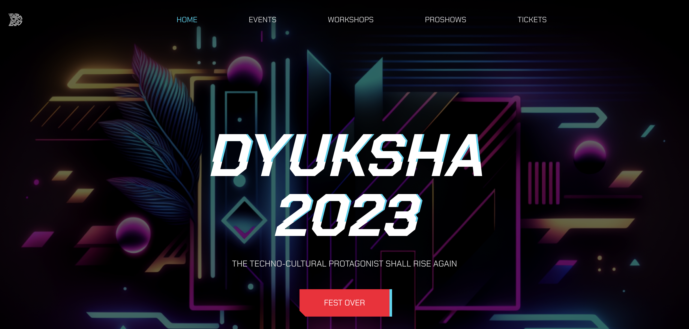
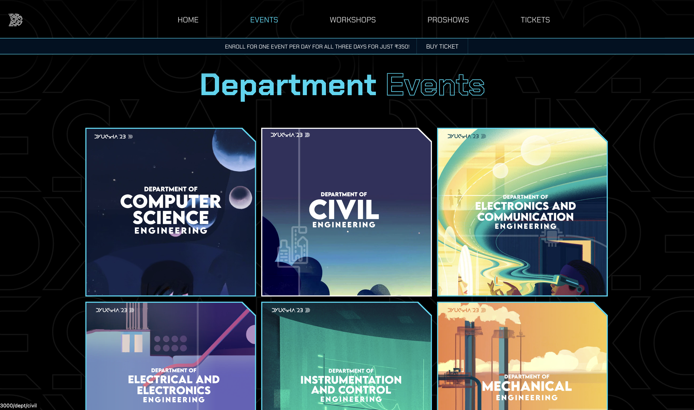
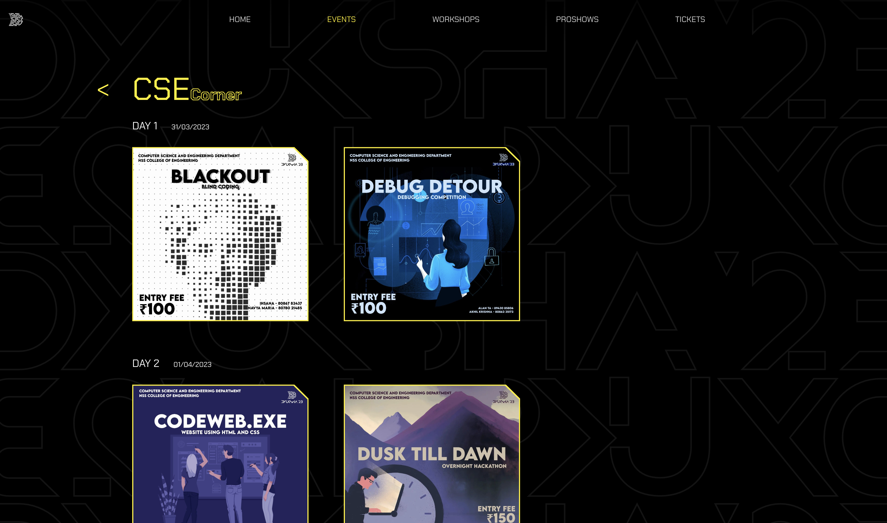
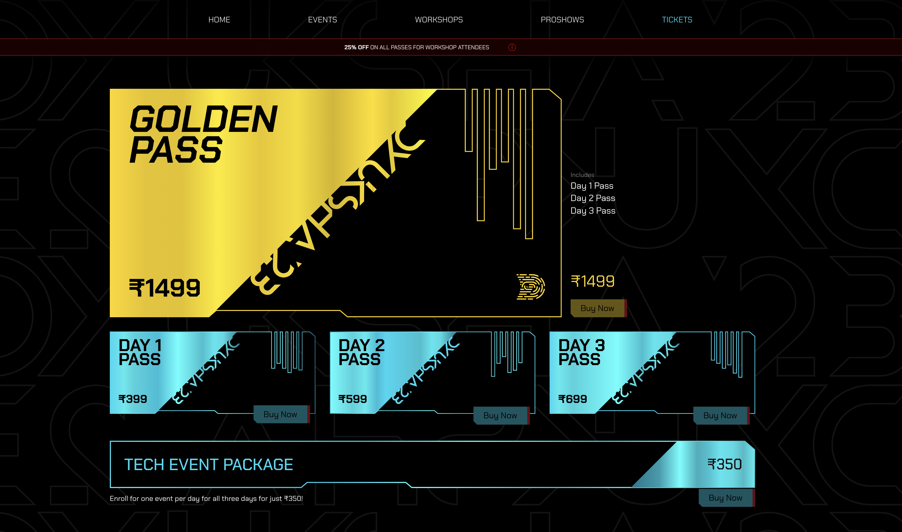
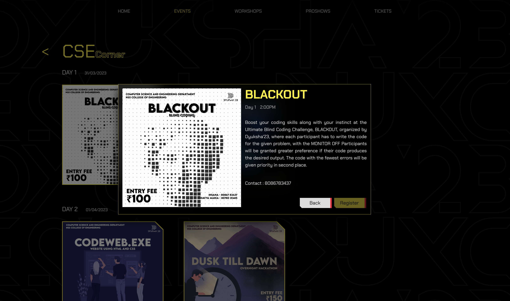

# Dyuksha 23 Website

This repository contains the source code for the website of Dyuksha 23, a national level tech fest conducted by NSS College of Engineering. The website allows users to view all the events organized for the fest and their timings.

### Technologies Used

* **Frontend:** ReactJS
* **Backend:** Firebase

### Screenshots

